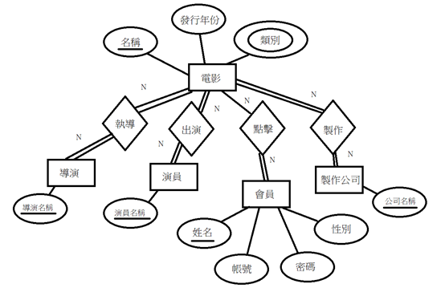
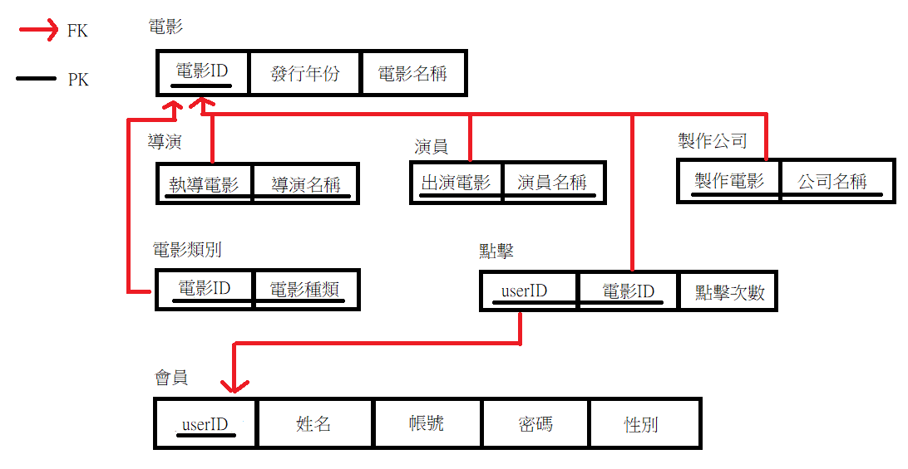

# DBMS 2020 final project

### Team Info
- Name: **CCLab**
- Members: [LuJiaYu](https://github.com/lujiayu0807), [Ivy](https://github.com/ivy753116), [Jacky](https://github.com/jacky18008), [Rainboltz](https://github.com/rainboltz), [LittleCube](https://github.com/littlecube2019)

### Database Structure
using [SQL file](https://drive.google.com/open?id=15H_NnfM33FYJO-HLSnuzr-a3msspqZ8d) to import [MovieLens-1M](https://grouplens.org/datasets/movielens/1m/) dataset into the PostgresDB
```bash
psql -f "ml1m" -U username
```


